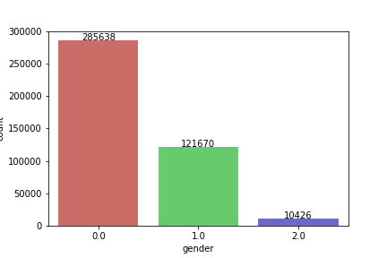
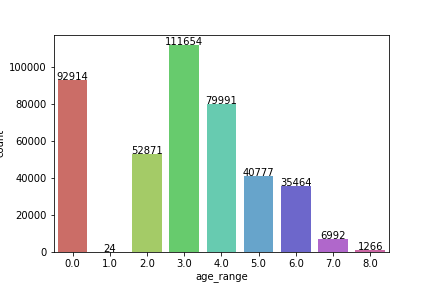
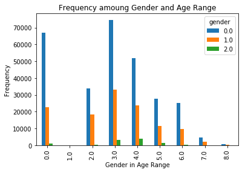
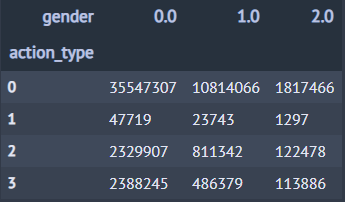
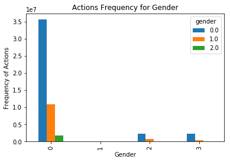
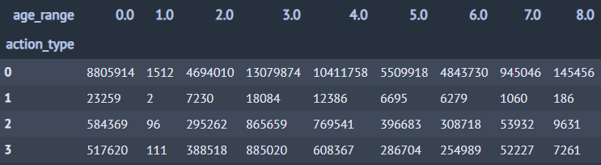
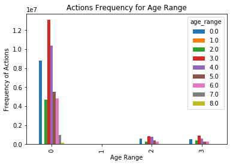

# 天貓顧客分析

## Data Explore

### Users

1. via user_log_format1
> 1. 不重複的 user_id 有 424170 個

2. via user_info_format1
> 1. 不重複的 user_id 有 424170 個
> 2. 有性別資料的 417734 個

**Users' Gender**
> 

**Users' Age Range**
> 

**Users' Gender versus Age Range**
> 

### Actions

**Action versus Gender**
> 

> 

**Action versus Age Range**

> 

> 
